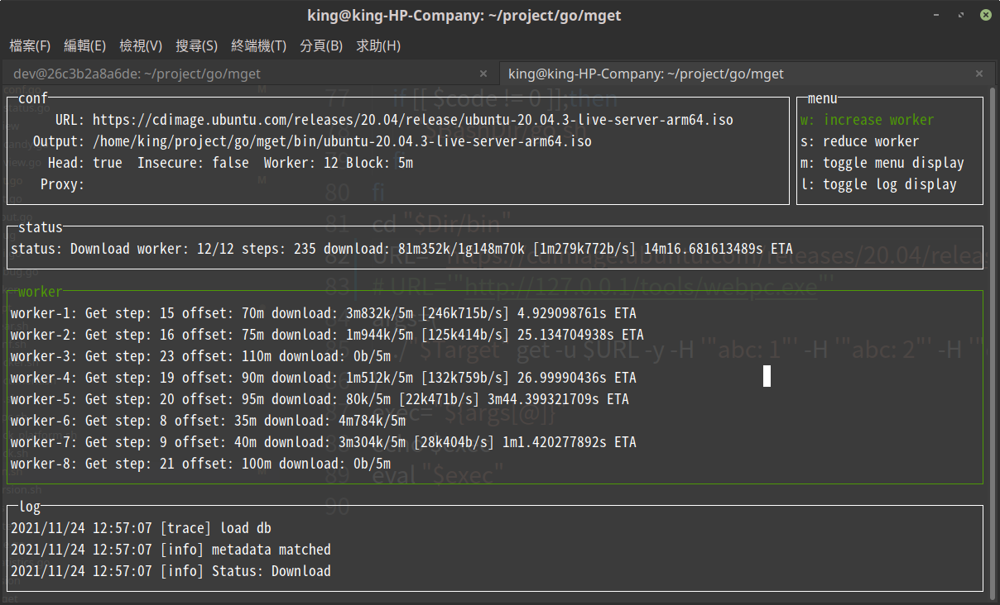

# mget
http multithreaded download tool

Originally I thought that http multi-threaded download was meaningless, because the network card speed was much lower than the hard disk, but I was wrong. Some website download servers limit the download speed of a single http request. At this time, multi-threaded download can break through this limitation and increase the download speed.

* Abnormal or exit before the download is complete, you can resume the download from the downloaded location next time
* You can dynamically increase or decrease worker threads when downloading
* Although the description is multi-threaded, it is actually multiple goroutines

# How
```
$ ./bin/mget get -h
http get download file

Usage:
  mget get [flags]

Examples:
mget get -u http://127.0.0.1/tools/source.exe
mget get -u http://127.0.0.1/tools/source.exe -o a.exe

Flags:
  -H, --Header strings      http request header key: value
  -a, --agent string        http header User-Agent (default mget/v0.0.1; linux amd64 go1.16.5)
  -b, --block size string   download block size for each worker [g m k b] (default "5m")
  -c, --cookie strings      http request cookie
      --head                send HEAD request file meta information before download
  -h, --help                help for get
  -k, --insecure            allow insecure server connections when using SSL
  -o, --output string       download target output file path
  -p, --proxy string        socks5://xxx http://xxx
  -u, --url string          http download address
  -w, --worker int          number of workers performing downloads (default 12)
  -y, --yes                 answer yes to all questions
```

